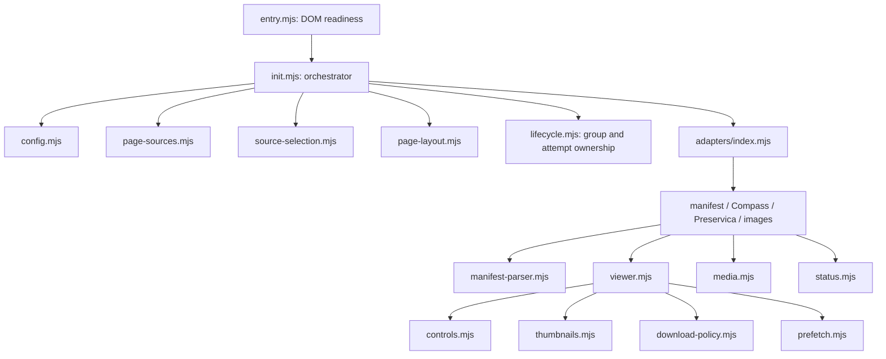

# DV-M01: module boundaries and build decision

Implementation: DV-M04 establishes this build and first extraction; see [current build instructions](plugin-build.md).

Date: 2026-09-18. Product: ArchivesSpace PUI `digital_viewer`.
Design baseline: standalone commit `190a536`; runtime remains `2b863370bed0f57db3069a071b641dae0cf13754`. This document specifies future implementation under DV-M03–DV-M08. No modules, build scripts or dependencies have been installed by DV-M01.

## Decision

Maintain JavaScript as ES modules under `src/`, bundled with **esbuild** into the existing `public/assets/digital_viewer.js` classic script. Keep OpenSeadragon as the existing separate vendored asset and CSS as a separate maintained file. Do not introduce React, TypeScript, dynamic imports, split chunks or browser module loading in this refactor.

The important gain is explicit module ownership and testable exports. One distributed script remains acceptable: source maps connect it to the smaller files. Splitting source cannot make an interactive viewer work with JavaScript disabled; DV-M02 separately owns that access problem.

| Option | Decision basis |
| --- | --- |
| Native browser modules | Avoids a bundler, but changes script timing, module URL/MIME delivery, asset inventory and cache/version handling for every import. Would need new root/non-root PUI and host-policy verification. |
| One classic bundle | Adds a developer build step but preserves the current template URL/order and avoids a new runtime module request graph. Selected for this existing plugin deployment. |

esbuild supports browser bundling, IIFE output, syntax targets and linked source maps; see its official [API documentation](https://esbuild.github.io/api/). These capabilities inform the choice, not a claim that this project's build has already been tested.

## Proposed module graph

Arrows mean a caller depends on a callee. All paths below are proposed under `src/`; current implementations remain in `public/assets/digital_viewer.js`.



Small pure helpers (`links.mjs`, `tile-sources.mjs`) can be shared without importing startup, adapters or the DOM scanner. The diagram omits these leaf edges for readability. Pass configuration, browser APIs, status callbacks and an attempt interface explicitly. Controls/queues never import `init` or select a fallback. Lifecycle receives a layout-release callback; it must not import layout or the adapter registry. The orchestrator supplies the registry's mount callback, preventing a lifecycle ↔ adapter cycle. `entry.mjs` alone reads `window.DigitalViewer`, receives `window.OpenSeadragon`, and registers DOM readiness.

## Existing function inventory

This covers every named function declared directly in the current outer closure, once each. Nested callbacks stay with their owning function until extraction demonstrates a useful smaller boundary. Module sizes are guided by responsibility, not a line-count cap.

| Proposed module | Existing functions to move or adapt |
| --- | --- |
| `config.mjs` | `parseCantaloupeBase`, `parseCompassHost`, `getLoadingTimeout` |
| `links.mjs` | `sanitizeUrl`, `createFallbackLink` |
| `source-selection.mjs` | `detectSource`, `descriptorPriority`, `pickBestDescriptor`, `descriptorSelectionPriority`, `buildDescriptorSelection` |
| `controls.mjs` | `makeButton`, `setButtonActive`, `setButtonPressed`, `clamp`, `cloneDefaultImageAdjustments`, `getViewerImageAdjustments`, `getViewerVisualTarget`, `buildViewerImageFilter`, `applyViewerImageAdjustments`, `adjustViewerImageSetting`, `setViewerImageSetting`, `toggleViewerImageSetting`, `resetViewerImageAdjustments`, `isViewerFlipped`, `setViewerFlip`, `rotateViewer`, `resetViewerTransforms`, `getViewerZoomPercent`, `isElementInside`, `setControlsCollapsed`, `setAdjustPopoverOpen`, `syncAdjustPopover`, `syncToolbarState`, `makeAdjustmentRangeControl`, `makeAdjustmentToggle`, `makePopoverActionButton`, `buildAdjustPopover`, `buildPrimaryControls`, `buildControlsToggle`, `addControls`, `addPageNav` |
| `thumbnails.mjs` | `getPreloadPageIndexes`, `buildThumbnailUrl`, `addThumbnailCarousel` |
| `tile-sources.mjs` | `getTileSourceValue`, `isUnavailableTileSource`, `hasRenderablePages` |
| `download-policy.mjs` | `getTileSourceImageUrl`, `getCompanionPdfUrl`, `setElementHidden`, `getViewerModeLabel`, `syncViewerModeActions`, `addViewerModeActions` |
| `lifecycle.mjs` | `getContainerViewerOptions`, `disposeViewer`, `isAttemptActive`, `registerAttemptCleanup`, `disposeAttempt`, `clearAttemptTimeout`, `scheduleAttemptTimeout`, `disposeMountState` |
| `prefetch.mjs` | `primeResourceUrl`, `warmSequenceCache` |
| `viewer.mjs` | `mountOsdViewer` |
| `status.mjs` | `showError`, `reportFailure`, `showLoadingNotice`, `clearLoadingNotice`, `resetContainer` |
| `adapters/compass.mjs` | `toLocalCantaloupeInfoUrl`, `mountCompass` |
| `adapters/images.mjs` | `mountCantaloupe`, `waitForImageLoad`, `mountStaticImage` |
| `manifest-parser.mjs` | `extractManifestContent`, `getManifestNodeId`, `getCanvasMetadataValue`, `extractCompassTileSources` |
| `adapters/preservica.mjs` | `mountPreservica` |
| `media.mjs` | `mountVideoViewer`, `mountAudioViewer`, `mountPdfViewer` |
| `adapters/manifest.mjs` | `mountCompassManifest` |
| `adapters/index.mjs` | `mountDescriptor` |
| `page-sources.mjs` | `collectSourceAnchors`, `collectFileUris`, `findGroupRoot`, `getPageContext` |
| `page-layout.mjs` | `findInsertAfter`, `classifyPageContext`, `prepareLeafLayout`, `restoreLeafLayoutIfUnused` |
| `init.mjs` | `init` |

`entry.mjs` is new; it takes the final DOMContentLoaded block. `init`'s nested `tryMount` moves into the lifecycle coordinator, with source selection and layout remaining in the orchestrator. `mountCompassManifest` becomes generic manifest mounting; keep existing descriptor labels until their producers, consumers and tests change together. Parser functions accept an explicit service-URL normalizer instead of importing the Compass adapter or reading `cfg`. Keep current parser outputs initially; extraction must not silently change unsupported-canvas or mixed-content behavior.

## State inventory and ownership

| Current state | Proposed owner and lifetime |
| --- | --- |
| `cfg`, normalized after construction | `config.mjs` returns a validated snapshot; entry passes it to the application. No module reads environment/window configuration directly after startup. |
| `UUID_RE`, `DEEP_ZOOM_RE`, `STATIC_IMAGE_RE`, `PDF_RE` | Private constants in source selection. |
| `SEQUENCE_PRELOAD_DISTANCE` | Prefetch policy constant. |
| `THUMBNAIL_SIZE`, `THUMBNAIL_TIMEOUT_MS` | Thumbnail module constants. |
| `IMAGE_ADJUSTMENT_STEP`, `DEFAULT_IMAGE_ADJUSTMENTS` | Controls defaults; clone per viewer rather than mutate shared defaults. |
| `UNAVAILABLE_TILE_SOURCE` | Tile-source helper's immutable placeholder definition; preserve page position. |
| `warmedResourceUrls` | Application-owned prefetch cache injected into viewer prefetch sessions. Current speculative fetches are not attempt-owned; DV-M06 must give each request an owner and disposal rule without canceling a resource another live session uses. Do not mistake this for an existing guarantee. |
| `viewerControlInstanceCount`, `sourceGroupCount` | Application-owned ID allocators passed to controls and page scanning; preserve uniqueness across repeated initialization. |
| `activeMountStates` | Lifecycle registry keyed by group root identity, not source URL. Different groups can share a URL. |
| `root/container.__dvMountState` | Registry entry: root, container, candidate signature, attempt, disposed/seen flags, layout pane. Replace expandos with a private registry API as callers migrate. |
| `container.__dvDescriptorSelection`, `__dvMountOptions`, `__dvMountAttempt` | Explicit selection/mount context passed to adapters and controls. `getContainerViewerOptions` is a compatibility bridge to retire, not the desired API. |
| `viewer.__dvImageAdjustments` | Per-viewer controls state, disposed with that viewer. |
| `pane.__dvLeafLayoutState` | Layout session owns metadata/viewer columns and restores them when its last group releases it. |
| Attempt controller, viewer, timers, cleanups, deadline and active/disposed/completed/timedOut/loadingShown flags | Lifecycle attempt; invalidate before canceling requests/destroying the viewer so late callbacks cannot act. |
| `mountOsdViewer` closure: settled/open timeout, first-tile timer/readiness, active page, page error, image owners, current image, active metadata request, disposed flag | Viewer session owns OSD events and request-to-page identity. Metadata ownership is per request/page occurrence, not just URL; preserve rapid A→B→A behavior. |
| Controls/popover/collapse state, mode/current-page/download state | Control components own their state and return cleanup functions; document click/keydown listeners must be removed when disposed. Current cleanup follow-up remains DV-M06 work. |
| Thumbnail queue, active cancel function, observer, buttons and disposed flag | One thumbnail session per viewer; serial queue, bounded timeout, cancellation and observer disconnect owned there. A preview failure never fails the main viewer. |
| Static-image load listeners/timer; native media elements | Image/media session cleanup registered with the attempt. Retain cached-image completion handling; do not infer PDF success from an iframe load event. |

No new global state container is proposed. Configuration is application-wide; group attempts and viewer UI state are local to their owners. The remaining DOM attributes (`data-dv-page-context`, record type/children and source groups) remain a public template contract under DV-M03, separate from private runtime state.

## Contracts for extraction

These are intended interfaces, not claims that today's functions already return these shapes. Use plain JavaScript objects with JSDoc; exported types can be documented without adopting TypeScript.

### Source descriptor and selection

Preserve the current discriminated variants first:

| `type` | Required payload |
| --- | --- |
| `cantaloupe` | `infoUrl` |
| `static-image` | `imageUrl` |
| `static-pdf` | `url` |
| `compass` | `compassUrl` |
| `compass-manifest` | `manifestUrl` (also used by non-Compass manifests today) |
| `preservica` | `uuid` |

`detectSource(uri, config)` returns a descriptor or `null`, with no requests or DOM changes. A candidate is `{item: {uri, anchor}, descriptor}`. Selection returns `{primaryCandidate, rankedCandidates, companionCandidates}` without changing the candidate array. Keep selection priority and same-object PDF companion policy. URLs are internal data, never diagnostic payloads. Sanitization remains mandatory at URL insertion/download boundaries.

### Source group and page context

`PageContext = {recordType, hasChildren, paneExists}`; normalize an absent/unknown child flag without introducing a new leaf classification. `SourceGroup = {root, items: [{uri, anchor}]}`. Root DOM identity defines group ownership; remove duplicate URLs only inside a group. Leaf Digital Object grouping and separately linked Archival Object grouping retain current behavior. The registry derives the existing ordered-URI signature to reuse or replace a mount; DV-M03 must not collapse distinct records merely because their URLs match.

### Adapter result and readiness

Target API: `mount(descriptor, context) -> Promise<MountResult>`, where context carries `{container, config, selection, attempt, services, status}`. `services` explicitly provides fetch, OpenSeadragon and renderer dependencies. `MountResult = {kind, readiness, dispose}`; `kind` identifies image/sequence/PDF/media and `dispose()` is idempotent. This is a uniform wrapper around today's mixed return types, not a change to content policy.

Readiness must remain honest: OSD's initial open resolves before every tile is drawn; a static image resolves on successful load (including valid cached completion); a native PDF/audio/video element can only report `mounted`, not proven playback or readable PDF success. Return `readiness: 'opened' | 'loaded' | 'mounted'` accordingly. DV-M02 must not hide a usable fallback merely because a PDF iframe was inserted. Page/tile errors after initial readiness go to viewer status, not a new whole-object fallback unless existing policy explicitly requires it.

Invalid sources and initial load failures reject with a bounded stage/code. The coordinator wraps adapter calls in a promise to catch synchronous exceptions too. During migration preserve existing failure behavior while moving final user reporting to the coordinator; never log raw exceptions, source URLs or query strings. Cancellation is an internal outcome ignored by retired attempts, not a visible content failure. Media combinations retain their current routing; improving Preservica mixed-media behavior is outside this extraction.

### Mount attempt and cleanup

Target attempt interface: `signal`, `isActive()`, `registerCleanup(fn)`, `registerTimer(id)`, `attachViewer(viewer)`, `complete()`, `dispose()`. A group owns at most one active attempt. It has one initial deadline spanning fetch, body parsing and initial open. When an alternative exists, expiry disposes the old attempt and advances once. For the final candidate, expiry shows one loading note and keeps the attempt alive for later success/failure. Completion clears the initial deadline but does not dispose the live viewer. Tile/thumbnail timers have their own owners.

Disposal first marks inactive, then clears timers, aborts owned requests, destroys owned viewers and removes listeners/observers. Cleanup continues if one callback throws. Every async callback checks ownership, even when abort is unavailable or too late. Adapter-created resources register immediately, before a promise can reject. Returned `MountResult.dispose` wraps the same cleanup scope, so registry teardown and adapter failure cannot double-destroy resources. The lifecycle registry receives a layout-release callback rather than importing the layout module.

## One successful manifest and one fallback

```mermaid
sequenceDiagram
    participant R as Ruby templates
    participant E as Entry / init
    participant P as Page sources / selection
    participant L as Lifecycle
    participant A as Manifest adapter
    participant V as Viewer / OSD
    R->>E: Configuration + source links + page attributes
    E->>P: Read groups and select candidates
    P-->>E: Group and ranked descriptors
    E->>L: Mount group with prepared container
    L->>A: First descriptor + attempt context
    A->>A: Fetch JSON and parse ordered sources
    A->>V: Mount image sources with attempt
    V-->>L: Initial open succeeds
    L->>L: Clear initial deadline; retain viewer ownership
    V->>V: Load tiles, thumbnails and handle navigation
```

```mermaid
sequenceDiagram
    participant L as Lifecycle
    participant A as Primary adapter
    participant B as Alternative adapter
    participant S as Status / original links
    L->>A: Attempt A (fetch + parse + initial open)
    A-->>L: Initial failure or deadline with alternative
    L->>A: Invalidate and dispose A
    L->>B: Attempt B with independent request ownership
    A-->>L: Late callback (ignored)
    alt B becomes ready
        B-->>L: Mount result
        L->>L: Clear B deadline
    else B remains slow and is final
        L->>S: One loading note; keep B alive
    else B actually fails and is final
        L->>S: Content unavailable; preserve original links
    end
```

No-JS or blocked startup cannot execute this fallback coordinator. Server-rendered access belongs to DV-M02, and remains necessary regardless of module structure.

## Build, artifacts and release policy for DV-M04

- Source: `src/**/*.mjs`; entry: `src/entry.mjs`. Tool: esbuild as an exact-version development dependency with committed `package-lock.json`. Pin supported Node/npm versions in the build documentation and CI when DV-M04 selects and tests the actual package version; do not claim the Node used for today's baseline is the deployment requirement.
- Settings: browser platform, bundle enabled, IIFE format, no splitting, `target: 'es2017'`, no minification initially, linked external source map with source content. No `eval`-based tooling or new runtime dependencies. Retain legal comments/notices. JavaScript syntax targeting does not polyfill browser APIs such as fetch, URL or AbortController; preserve existing feature guards and test supported browsers. This supersedes the old ES5-compatible comment when implemented; ES5 browser support is not promised today by that comment alone.
- Generated files: commit `public/assets/digital_viewer.js` and its `.map` with a generated-file banner. Until DV-M04 lands, the JS remains manually maintained. Thereafter edit only `src/` and rebuild; never repair generated output directly. Commit source and output together so a pinned checkout remains installable without Node. OSD/CSS remain their existing independent assets.
- Reproducibility: build from locked dependencies, keep paths repository-relative, omit machine paths/timestamps, and compare fresh output against committed output. CI fails on missing/stale outputs. The same artifact is used in browser tests, packaging and the parent mirror.
- Source maps: ship `digital_viewer.js.map` beside the script, with embedded public source text and no secrets/local absolute paths. Link it relatively so a PUI prefix is respected. Version its reference with a digest of map bytes in the generated JS comment; the existing Ruby JS digest then changes when the map does, avoiding stale debugger maps. Verify actual map requests under root and prefixed PUI paths. If the host cannot serve maps, keep the identical map with the release for manual debugger loading and record that limitation; runtime must not depend on maps.
- Cache and template: keep `layout_head.html.erb`'s current config → OSD → viewer sequence and `app_prefix` handling. The Ruby helper still fingerprints all executed JS/CSS; extend its tests for the generated-output/map-reference chain. No new `type=module` or import-map/CSP requirement. Existing inline configuration may still require host CSP coordination; bundling does not solve that.
- Distribution: archive the committed runtime, templates, vendored notices and map from the exact candidate. Build/test tooling and `node_modules` are not host requirements. Verify the extracted archive and A→B→A cache/rollback behavior, rather than just the working source tree. Existing release approval gates remain in force.
- Parent mirror: authoritative maintained source is the standalone repository. Mirror generated runtime plus templates/tests needed by Docker into parent `plugins/digital_viewer/`, compare bytes, and record parent mirror state in its ledger. Do not use the React frontend's build or revive `frontend/` legacy plugin copies. WBL-0901 controls duplicate-copy disposition.

Planned command contract (DV-M04 must implement these; they do not exist yet):

```sh
npm ci
npm run build          # write the bundle and map
npm run build:watch    # developer rebuilds, not a new application server
npm test               # build, module tests and served-artifact integration tests
npm run check:generated # build into a temporary directory; compare, do not overwrite
ruby test/asset_version_test.rb
```

Browser checks remain separately invoked under `test/browser/README.md`; do not turn ordinary unit tests into network-dependent ASpace tests. The current test harness rewrites the closing IIFE to export closure functions into `vm.runInNewContext`. DV-M04 must replace that brittle instrumentation: import module APIs for unit tests and run the unmodified generated artifact with observable DOM/network assertions for integration coverage. A test-only entry may expose module APIs without adding hooks to the production global namespace. Map all existing regressions to the new tests before removing any old harness path.

At DV-M04 update the maintenance guide, README and parent `CLAUDE.md`/`AGENTS.md` with the build-before-test instructions, generated-file rule, real test paths and dependency installation. Keep current instructions accurate until then. DV-M08 updates the full symptom-to-module map and replaces current line-number navigation; dated review anchors remain explicitly historical.

## Baseline verification and fixtures

Fresh on 2026-09-18 at documentation baseline `190a536` (runtime unchanged):

| Command from standalone root | Result |
| --- | --- |
| `node --test test/*.mjs` | 70 passed, 0 failed, 0 skipped; Node v26.8.2 |
| `ruby test/asset_version_test.rb` | asset version checks passed; Ruby 2.6.10 |

These establish a unit/Ruby baseline, not new browser or hosted acceptance. Documentation validation also checks complete function-inventory coverage, relative links and unchanged runtime/test files.

Reuse [fixture-ledger.md](fixture-ledger.md) and [browser instructions](../test/browser/README.md):

| Regression area | Existing fixture / runner |
| --- | --- |
| Single and sequence images | Local DO 869/AO 4096 (single); DO 863/AO 4097 (77 pages); DO 864/AO 4098 (41); DO 867/AO 4099 (36). Confirm local identities before running. |
| Group isolation/layout | AO 4100; `runLocalLayoutChecks` and asset-disabled control, actual left/right sidebar configs. |
| PDF, scanned images, separate linked objects | DO 875–879/AO 4105–4109 and AO 4110; `local-formats.mjs`. Local PDF server required; not hosted fixture URLs. |
| Thumbnail stalls/disposal | `runThumbnailQueueChecks`: intercepted three-page fixture, native observer on/off. Node suite also checks 77 numbered buttons. |
| Metadata-request ownership | `runSourceRequestOwnership`: intercepted B→A→B and retired/current failure cases; Node suite covers cross-group identity and late callbacks. |
| No-JS and startup failures | Prior PDF no-JS evidence is a limited baseline; DV-M02 adds manifest-only and separately blocked-script cases. |

No browser suite rerun is required to complete this documentation ticket. DV-M04 and subsequent changes must run the relevant artifact/browser checks before claiming extraction compatibility. Track completion in parent `preservica/docs/workbench-lite/finished.md`; DV-M01 does not approve installation or close any other DV/LYR/WBL ticket.
